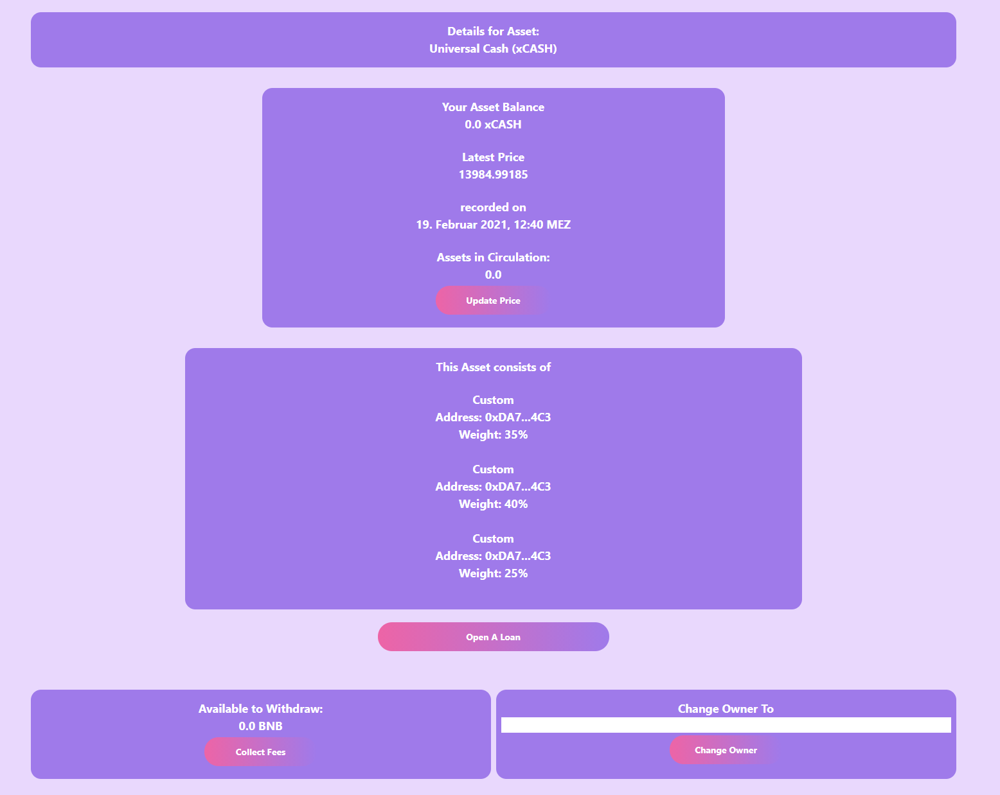

# Conjure
Repository for the Conjure Project for the Binance BSC Hackathon

# Deployed Addresses

## Mainnet
Conjure Factory Contract [0x3c4903f67f7623a5627D217F50c6fd9C304E06b5](https://bscscan.com/address/0x3c4903f67f7623a5627D217F50c6fd9C304E06b5#code)

Collateral Factory Contract [0x6295EC56620444454Dc7147495997Ae9422871e6](https://bscscan.com/address/0x6295EC56620444454Dc7147495997Ae9422871e6#code)

Bsc Mainnet Dapp Address:  [https://bsc.conjure.finance](https://bsc.conjure.finance)
## Bsc Testnet
Conjure Factory Contract [0xC5f1B0F3B7A765F8ba2bdc9bf1F1002fd7B12234](https://testnet.bscscan.com/address/0xC5f1B0F3B7A765F8ba2bdc9bf1F1002fd7B12234#code)

Collateral Factory Contract [0x0BCC2bbF5893A72188CE7c3DeaB206470Dd69978](https://testnet.bscscan.com/address/0x0BCC2bbF5893A72188CE7c3DeaB206470Dd69978#code)

Bsc Testnet Dapp Address:  [https://bsctestnet.conjure.finance](https://bsc.conjure.finance)
# Description
By letting users simply set a reference source through oracle contracts to any contracts they wish, users can create completely arbitrary assets for any targeted assets they want. They can create synths which use med price from 5 oracles to produce say Synthetic BTC or average price from 4 sources to create a basket currency from USD, GBP, Euro, CNY to hedge monetary policy risk.

# All the Synths
By allowing users to simply provide 3 to 7 oracle sources, the contract will take the market value from the oracle set, using a safety param that allows for .33 to .45 failure and fault tolerance and use that along with a collateralization rate set at 1.2x, the system can mint any asset aslong as that asset has a price source. Using projects such as Link, Band Protocol or any signed values by exchanges the user can deposit BNB as collateral and mint the synthetic asset on demand. This contract can then be used by others to mint the same synth or choose another Synthesizer with different oracle sources allowing for market competition between Synthesizers competing for the most reliable synth for the asset. You can use this model to make synthetic currencies, commodities or synthesize weather, aslong as it has a value which can be tracked you can Conjure it.

# How It's Made
Oracles - generalized oracle struct to allow for calling oracle contracts to get reference rates and the target price for the asset.

Snx based collateralization and liquidation - allows you to collateralize the assets and keep collateralization beyond the needed amount to keep the target synth value

# Deepdive

## Conjure your asset

You can go directly to our dapp which is deployed on mainnet and the BSC Testnet. The system asks you to sepcify a name and a symbol for your new asset and you simply confirm it with the wallet of your choice.

Also you will get an overview over all new created synths directly on this page.

## Define your Sources

After the first transaction confirmed you can now set up your asset!

You can choose from different oracle providers: Chainlink (only available on Mainnet), Band Protocol, a custom function call and also you can use the price of an already existing Conjure Asset.

Also you can set a minting fee up to 2.5% which will be paid to you everytime a user opens a loan on your asset.

**There are 2 asset types available** 

Single Asset (which takes the median price - so you can specify multiple oracles for the same price and hedge against one feed going down)

Basket Asset (which will take the average weighted price of all the sources you specified)

If you are happy with your selection you can fire up the 2ns transaction and your asset is now set up!

## Manage your Asset

After you have set up your asset you can now see the details of your asset here.

You can watch the latest price as well as the oracles your asset consists of.

If you are the owner of the asset you can also change the owner here and also collect the fees you already have earned

## Open a loan

On the Loan tab you can create a loan for every asset which is available on the Conjure platform. You will get an overview first and then can put in the amount you want to mint and the collateral BNB you want to use.

The system automatically generates your current C-Ratio (which is set to 120%) and you can then create a loan by clicking on Open Loan. If a minting fee was specified it will be added on top.

## Manage your Loans

Also, if you have any open loans, you can manage them on the loan tab also. You will see all your open loans here and their details.

You can deposit more BNB as collateral, withdraw BNB and also close the loan here.

## See Conjure in Action

*Video goes here**

# Repo Structure

This repo will be built upon using the Next.js Framework for building the Dapp
It will also cover a dedicated /contracts folder where all the Solidity sources and libraries will be held.
